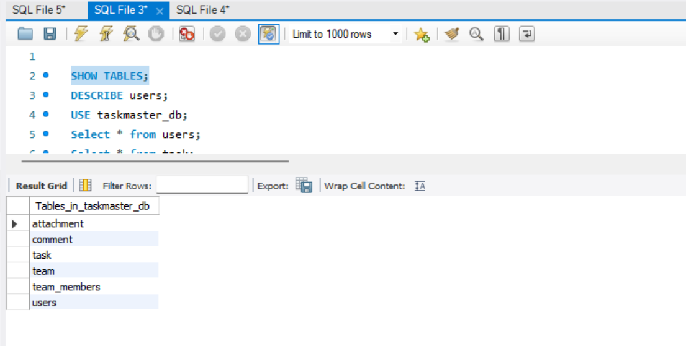
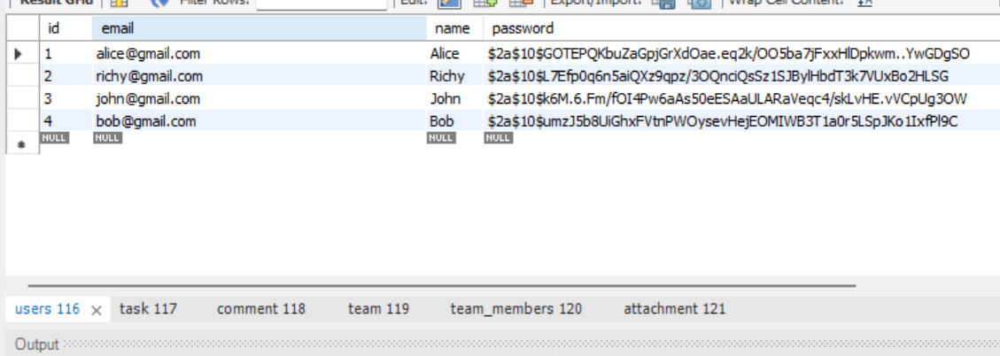
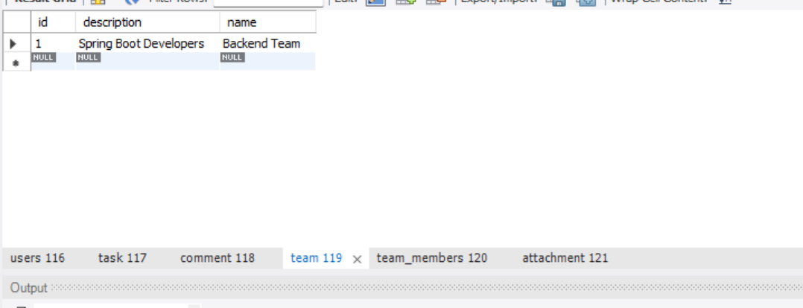
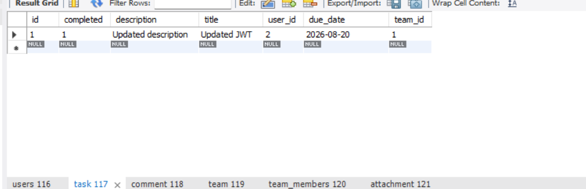
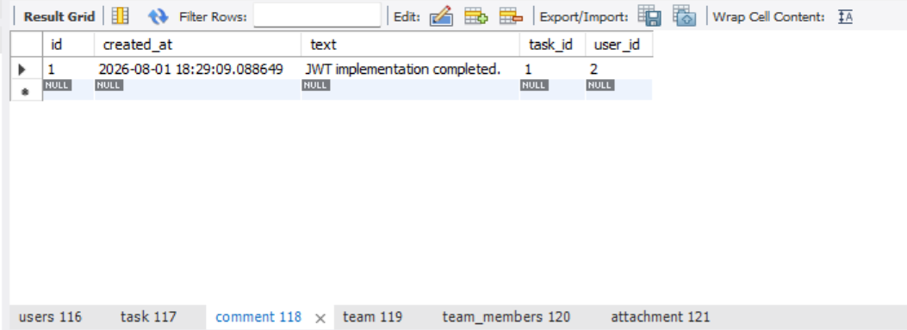
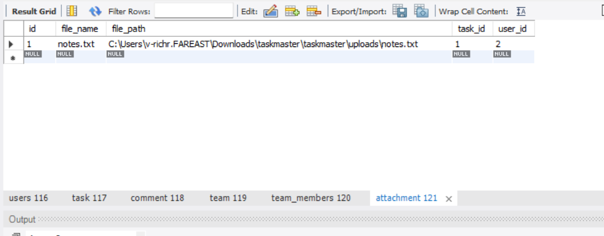

# TaskMaster - Collaborative Task Tracking System

TaskMaster is a Spring Boot REST API for collaborative task management. It enables users to register, authenticate using JWT, create and manage tasks, collaborate through teams, assign tasks, add comments, upload attachments, and search or filter tasks.

---

# Tech Stack

- Java 21
- Spring Boot
- Spring Security
- JWT Authentication
- Spring Data JPA (Hibernate)
- MySQL
- Maven
- Multipart File Upload

---

# Features

## User Management

- User Registration
- User Login using JWT Authentication
- Secure Logout Endpoint
- Password Encryption using BCrypt
- User Profile Support

## Task Management

- Create Task
- Update Task
- Delete Task
- Get Task by ID
- Get All Tasks
- Assign Task to Team Member
- Mark Task as Completed

## Task Search & Filtering

- Search Tasks by Title
- Filter Tasks by Completion Status
- Sort Tasks (Ascending / Descending)
- Pagination Support

## Team Collaboration

- Create Team
- Join Team
- Assign Tasks within Team
- Team Membership Validation

## Collaboration Features

- Add Comments to Tasks
- View Task Comments
- Upload Attachments
- View Task Attachments

---

# Project Structure

```
src
 ├── controller
 ├── service
 ├── repository
 ├── entity
 ├── dto
 ├── security
 ├── config
 └── resources
```

---

# Database Tables

The application creates the following tables:

- users
- team
- team_members
- task
- comment
- attachment

---

# API Endpoints

## Authentication

| Method | Endpoint |
|---------|----------|
| POST | /users/register |
| POST | /users/login |
| POST | /users/logout |
---

## Tasks

| Method | Endpoint |
|---------|----------|
| POST | /tasks |
| GET | /tasks |
| GET | /tasks/{id} |
| PUT | /tasks/{id} |
| DELETE | /tasks/{id} |
| PUT | /tasks/{id}/complete |
| PUT | /tasks/{id}/assign/{userId} |

---

## Task Search

| Method | Endpoint |
|---------|----------|
| GET | /tasks/search?title=JWT |
| GET | /tasks/status/{completed} |
| GET | /tasks/sort?field=title&direction=asc |
| GET | /tasks/page?page=0&size=5 |

---

## Teams

| Method | Endpoint |
|---------|----------|
| POST | /teams |
| POST | /teams/{id}/join |

---

## Comments

| Method | Endpoint |
|---------|----------|
| POST | /tasks/{id}/comments |
| GET | /tasks/{id}/comments |

---

## Attachments

| Method | Endpoint |
|---------|----------|
| POST | /tasks/{id}/attachments |
| GET | /tasks/{id}/attachments |

---

# Authentication

JWT authentication is used for securing all protected endpoints.

Protected requests require:

```text
Authorization: Bearer <JWT_TOKEN>
--

# DTO Usage

The project follows DTO-based API design.

- TaskRequest
- TaskResponse

Entities are not exposed directly through the REST API.

---

# Validation

The project uses Bean Validation annotations.

Examples:

- @NotBlank
- @Email
- @NotNull

---

# File Upload

Attachments are uploaded using Multipart File Upload.

Uploaded files are stored inside the uploads directory.

---

# Configuration

Create an `application.properties` file based on the provided `application.properties.example`.

Example configuration:

```properties
spring.datasource.url=jdbc:mysql://localhost:3306/taskmaster_db
spring.datasource.username=your_username
spring.datasource.password=your_password

jwt.secret=YOUR_SECRET_KEY
```

---

# Running the Project

Clone the repository

```
git clone <repository-url>
```

Navigate to the project

```
cd taskmaster
```

Run the project

```
mvn spring-boot:run
```

---

# Sample Database

The project includes sample data demonstrating:

- Users
- Teams
- Team Members
- Tasks
- Comments
- Attachments

---

## Database Tables



## Users Table



## Team Table


## Team Members Table



## Task Table



## Comment Table



## Attachment Table



---

# Future Improvements

- Real-time Notifications (WebSocket)
- AI-generated Task Descriptions
- Email Notifications
- Role-Based Authorization
- Docker Support
- Unit & Integration Tests

---


